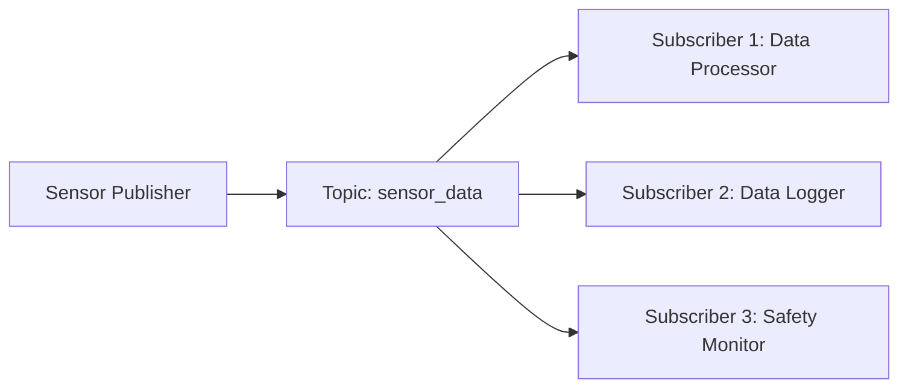

# Signals & Reflexes: Nodes, Topics, and Services

## Radio Stations vs. Phone Calls

Think about how you get information in different ways. When you listen to a radio station, it's continuously broadcasting—music, news, or talk shows flowing constantly. You can tune in and out at any time, but the broadcast continues regardless of whether anyone is listening.

This is exactly how **Topics** work in robotics.

On the other hand, when you need specific information right now, you make a phone call. You request something specific and expect a response immediately. If you call a restaurant to ask if they're open, you're making a direct request and waiting for their specific response.

This is how **Services** work in robotics.

## Topics: The Continuous Broadcast

Topics are like radio stations broadcasting sensor data constantly. A camera on a robot might publish images to a "camera_feed" topic, broadcasting new pictures many times per second. A distance sensor might publish measurements to a "distance_data" topic continuously.

Any number of other programs can subscribe to these topics. One program might process the camera images to recognize objects, while another might combine distance data to plan a safe path. The camera doesn't need to know who's listening—just like a radio station doesn't know who's tuned in.

This is perfect for sensor data that's constantly changing, like:
- Camera images
- Distance readings from sensors
- Robot position information
- Speed measurements

## Services: The Request-Response Connection

Services are like making a phone call when you need something specific done right now. You send a request and wait for a response. For example, if your robot needs to move its arm to a specific position, it would call a "move_arm" service with the desired coordinates and wait for confirmation.

Services are ideal for one-time actions like:
- Turning a light on or off
- Saving a map of a room
- Moving to a specific location
- Taking a single photograph

## The Simple Diagram

Here's how topics connect publishers and subscribers:

In this example, one sensor is broadcasting data to the topic, and three different programs are receiving and using that data for different purposes.

## Key Takeaway

Topics are for continuous data that many programs might want to use (like radio stations), while Services are for specific requests that need immediate responses (like phone calls). Together, they let different parts of your robot share information and coordinate actions.